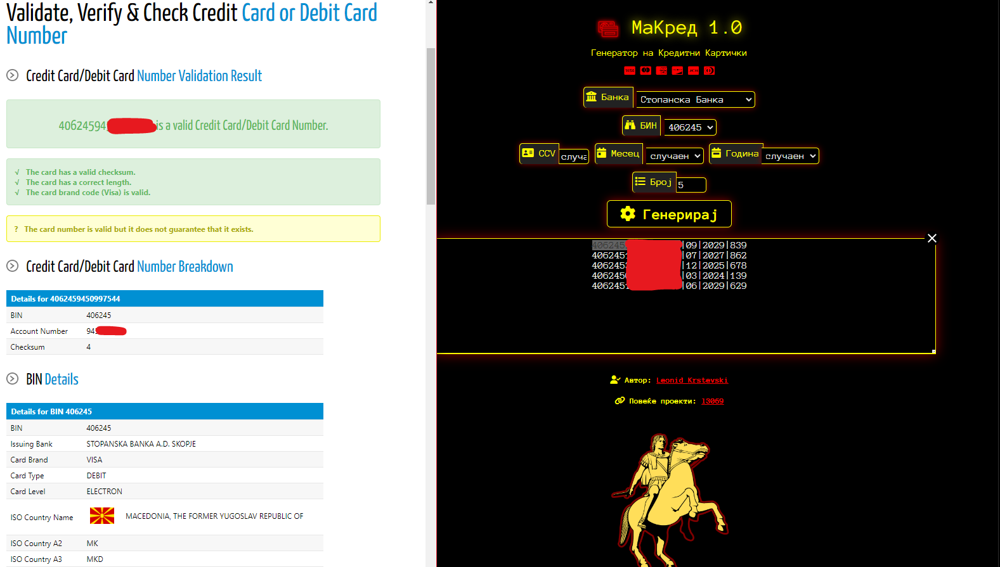

# МаКред 1.0 / MaCred 1.0

## Introduction / Вовед

**МаКред** е едноставен генератор на кредитни картички во Република Македонија и е создаден за едукативни и тестирачки цели. Оваа алатка овозможува генерирање на кредитни картички со избирање на банка и БИН (Bank Identification Number). Имајте предвид дека овој проект не е поддржан од ниедна компанија и авторот не е одговорен за последиците од вашето користење.

**MaCred** is a simple credit card generator created for educational and testing purposes. This tool allows you to generate credit cards by selecting a bank and a BIN (Bank Identification Number). Note that this project is not supported by any company, and the author is not responsible for any consequences arising from your usage.

## Project Requirements / Потребни датотеки

To run this project, you need the following:
* A web browser

За да го стартувате овој проект, потребен ви е:
* Веб прелистувач

## Features and Usage / Карактеристики и употреба

* **Bank Selection:** Choose a bank from the dropdown menu.
* **BIN Autofill:** Automatically populates BIN values based on the selected bank.
* **Card Generation:** Generate credit cards with customizable or random expiration dates and CCV codes.
* **Output:** Displays generated card details in a text area.

* **Избор на банка:** Изберете банка од паѓачкото мени.
* **Автоматско полнење на БИН:** Автоматски ги пополнува БИН вредностите според избраната банка.
* **Генерирање на картички:** Генерира кредитни картички со прилагодливи или случајни датуми на истекување и CCV кодови.
* **Резултати:** Ги прикажува генерираните детали за картичките во текстуален прозорец.

## Screenshots / Слики од екранот

## Disclaimer / Важно

* This program is intended for educational and testing purposes only. It should not be used for illegal activities, including but not limited to fraud, identity theft, or any other unlawful acts. The author is not responsible for any misuse of the program and disclaims any liability for any consequences arising from the use of this tool.

* Оваа програма е наменета само за едукативни и тестирачки цели. Не треба да се користи за нелегални активности, вклучувајќи, но не ограничувајќи се на, измама, кражба на идентитет, или било каква друга незаконска дејност. Авторот не е одговорен за никаква злоупотреба на програмата и не презема никаква одговорност за последиците од користењето на истата.

## Notes / Забелешки

* This project was created by **Leonid Krstevski**.

* For more projects, visit [**Portfolio**](https://github.com/l3069).

* Овој проект е создаден од **Леонид Крстевски**.

* За повеќе проекти, посетете [**Портфолио**](https://github.com/l3069).
